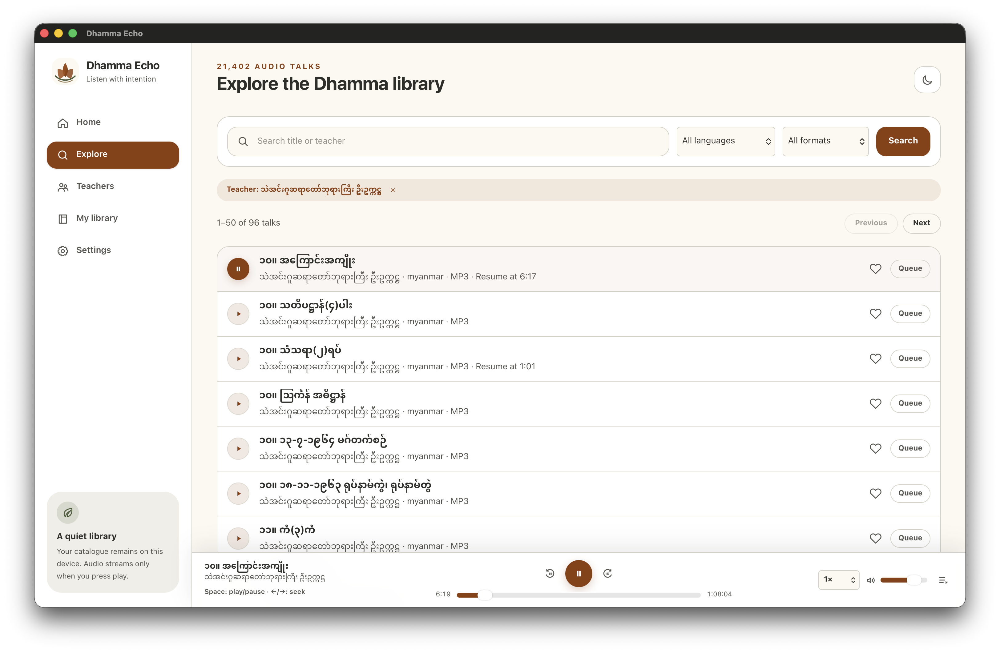

# Dhamma Echo

**A quiet desktop library for Dhamma talks.**

Dhamma Echo is a lightweight Tauri 2 desktop audio player built around the supplied read-only SQLite catalogue. It provides fast search, teacher browsing, queue management, favorites, listening history, resume positions, playback speed controls, and a calm light interface without accounts, analytics, or background services.



## Product website

The repository includes a dependency-free product website in [`docs/`](docs/index.html). It reuses the application screenshot above and deploys through the dedicated GitHub Pages workflow.

Preview it locally without installing dependencies:

```bash
python3 -m http.server 4173 --directory docs
```

Then open `http://127.0.0.1:4173`. Validate the complete static site with:

```bash
npm run site:verify
```

The site architecture and deployment boundary are documented in [Product website architecture](docs/architecture/product-site.md).

## Features

- Browse 30,563 audio talks from 257 teachers.
- Search by talk title or teacher.
- Filter by audio category, collection, teacher, Myanmar/English, and MP3/WMA.
- Browse 429 audio collections and open teacher detail pages with their collections and talks.
- Keep playable talks available with neutral labels when optional catalogue metadata is missing.
- Play approved MP3 audio through HTTPS with 15-second jump controls, seek, volume, speed, and queue management.
- Normalize and encode catalogue URLs, then retry across the approved `www` and bare Dhamma Download hosts.
- Store favorites, history, queue, settings, and resume positions locally.
- Upgrade approved same-host HTTP MP3 records to HTTPS before playback; WMA records remain searchable but unavailable in the macOS webview.
- Use the supplied SQLite database as an immutable bundled resource.
- Run a compiled Svelte 5 + TypeScript web UI inside a small Tauri shell.
- Render Myanmar text through system fonts; no font files are bundled.
- Use a regenerated macOS app icon with an optical safe area so it no longer dominates the Dock.

## Architecture

The webview can call only six purpose-built Tauri commands. Rust validates each request, executes parameterized read-only SQLite queries, normalizes catalogue text, and returns typed data. Playback and personal library state remain in the webview and local storage.

- [System context](docs/architecture/context.md)
- [Modules and trust boundaries](docs/architecture/modules.md)
- [Catalogue and playback data flow](docs/architecture/data-flow.md)
- [Build and release flow](docs/architecture/release.md)
- [Product website architecture](docs/architecture/product-site.md)
- [Product website design](docs/superpowers/specs/2026-08-05-github-pages-product-site-design.md)
- [Product and technical design](docs/superpowers/specs/2026-08-04-dhamma-echo-design.md)
- [Svelte migration design](docs/superpowers/specs/2026-08-10-svelte-frontend-migration-design.md)
- [Ralph Loop](docs/ralph-loop.md)

## Technology stack

- Tauri 2 desktop shell
- Rust 2024 edition
- `rusqlite` with bundled SQLite
- Svelte 5 with strict TypeScript and Vite
- Tailwind CSS v4 through the official Vite plugin with CSS-first design tokens
- Native HTML audio element
- Node's built-in test runner and V8 coverage

## Requirements

- Node.js 22.13 or newer
- Bun 1.3.14 or newer
- Rust 1.85 or newer with Cargo and rustfmt
- Platform prerequisites required by Tauri 2

Linux development additionally needs WebKitGTK 4.1 and the standard Tauri Linux build packages.

## Install

### Homebrew (macOS)

```bash
brew tap AungMyoKyaw/homebrew-tap
brew install --cask AungMyoKyaw/homebrew-tap/dhamma-echo
```

The app is ad-hoc signed (no Apple Developer certificate), so the cask removes the quarantine attribute on install. If macOS still blocks it, right-click the app and choose **Open** once.

### Prebuilt installers

Download macOS (`.dmg`), Windows (`.msi`, `-setup.exe`), or Linux (`.deb`, `.rpm`, `.AppImage`) installers from [GitHub Releases](https://github.com/AungMyoKyaw/dhamma-echo/releases).

### From source

Clone or extract the repository, then run:

```bash
cd dhamma-echo
bun install
```

This Svelte migration changes the frontend build dependencies. The execution sandbox used for the migration could not resolve Svelte packages, so it could not safely regenerate `bun.lock`. Run `bun install` once on a networked development machine with Bun 1.3.14, review and commit the resulting lockfile diff, then return to `bun install --frozen-lockfile --ignore-scripts` for deterministic CI/release installs. `src-tauri/Cargo.lock` remains unchanged.

## Run

Desktop development:

```bash
bun run tauri:dev
```

Browser preview with deterministic mock catalogue data:

```bash
bun run dev:web
```

Then open `http://127.0.0.1:1420`.

## Commands

| Command                  | Purpose                                                               |
| ------------------------ | --------------------------------------------------------------------- |
| `bun run dev:web`        | Start the Vite browser preview with HMR                              |
| `bun run tauri:dev`      | Run the Tauri desktop application                                     |
| `bun run format`         | Format web and Rust sources                                           |
| `bun run format:check`   | Verify formatting                                                     |
| `bun run lint`           | Run strict ESLint with zero warnings                                  |
| `bun run lint:offline`   | Run dependency-free whitespace checks                                 |
| `bun run typecheck`      | Run `svelte-check` and strict TypeScript checking                    |
| `bun run test`           | Run the core TypeScript behavior tests                               |
| `bun run test:coverage`  | Enforce 100% line/branch/function coverage on core TypeScript modules |
| `npm run site:test`      | Run product website behavior and link tests                           |
| `npm run site:smoke`     | Validate static assets, paths, budgets, and runtime isolation         |
| `npm run site:verify`    | Run all dependency-free product website checks                        |
| `bun run build:web`      | Produce the web assets in `dist/`                                     |
| `bun run smoke:web`      | Validate required production web assets                               |
| `bun run icons:generate` | Regenerate desktop icon variants from the 1024px master               |
| `bun run icons:check`    | Validate icon dimensions, margins, headers, and Tauri references      |
| `bun run verify:web`     | Run all locally available web quality gates                           |
| `bun run verify`         | Run full frontend and Rust quality gates                              |
| `bun run tauri:build`    | Build native installers for the current platform                      |
| `bun run clean`          | Remove generated web and coverage output                              |

## Testing and coverage

The core TypeScript behavior modules are covered by behavior-focused tests. The local Node coverage command enforces 100% lines, branches, and functions for those modules. Node's built-in coverage reporter does not expose a separate statement metric, and Svelte component executable code is validated separately by `svelte-check`, the Vite production build, and web smoke checks. The release report must not call the project-wide 100% statement/component coverage requirement complete unless a tool actually measures it.

Rust tests cover normalization, request validation, query filtering, pagination, error paths, secure URL classification, and in-memory SQLite integration. Run them with:

```bash
cargo test --manifest-path src-tauri/Cargo.toml --all-features
```

The migration evidence and explicit blocked gates are recorded in [docs/verification/2026-08-10-svelte-frontend-migration.md](docs/verification/2026-08-10-svelte-frontend-migration.md).

## Build and package

```bash
bun run tauri:build
```

Tauri creates platform-native bundles under `src-tauri/target/release/bundle/`. Build and sign each platform on its native CI runner. Signing credentials must be provided only through protected GitHub Actions secrets.

## Configuration

No environment variables are required for development. The application uses:

- `src-tauri/resources/dhamma.db` as the bundled catalogue.
- `src-tauri/capabilities/default.json` for the minimum webview capability.
- `src-tauri/tauri.conf.json` for CSP, window, resources, packaging, and generated desktop icons.
- Browser local storage for personal settings and listening state.

## Security and privacy

- No accounts, analytics, advertisements, or telemetry.
- No arbitrary shell, filesystem, SQL, or network command is exposed to the webview.
- SQLite opens read-only and uses parameterized queries.
- The CSP permits media only from `https://dhammadownload.com` and `https://www.dhammadownload.com`.
- The frontend accepts only approved MP3 URLs, removes credentials/ports/fragments, upgrades HTTP to HTTPS, and encodes paths before playback.
- Local preferences never leave the device.
- Report security issues using [SECURITY.md](SECURITY.md).

## Data and licensing

Source code and original visual assets are licensed under MIT. The bundled `dhamma.db`, catalogue metadata, remote audio, teacher names, and teachings are **not relicensed by this repository**. See [DATA_LICENSE.md](DATA_LICENSE.md) before public redistribution.

## Troubleshooting

### A track is visible but will not play

WMA records are kept searchable but are not supported by the macOS webview player. For MP3 records, use the in-player **Retry** action; Dhamma Echo retries both approved HTTPS hostnames, but it cannot recover a file removed or blocked by the remote service.

### Myanmar text uses an unexpected font

Install or enable a Unicode Myanmar font such as Noto Sans Myanmar, Myanmar Text, or Pyidaungsu. The application deliberately does not bundle font files.

### Native build fails on Linux

Install Tauri's WebKitGTK 4.1 development dependencies and `patchelf`, then rerun `bun run tauri:build`.

### Registry installation fails

Confirm Bun and Cargo can reach their configured registries. This repository does not vendor third-party packages.

## Contributing

Read [CONTRIBUTING.md](CONTRIBUTING.md), follow the [Code of Conduct](CODE_OF_CONDUCT.md), and run `bun run verify` before opening a pull request.

## Release process

1. Refresh and commit lockfiles when dependencies change.
2. Run `bun run verify` on a supported development machine.
3. Test native packages on macOS, Windows, and Linux.
4. Update [CHANGELOG.md](CHANGELOG.md) and version fields.
5. Tag `vX.Y.Z`; the release workflow builds platform artifacts.
6. Review and sign the generated installers before publishing the release.

## License

MIT for the source code and original project assets. See [LICENSE](LICENSE) and [DATA_LICENSE.md](DATA_LICENSE.md).
