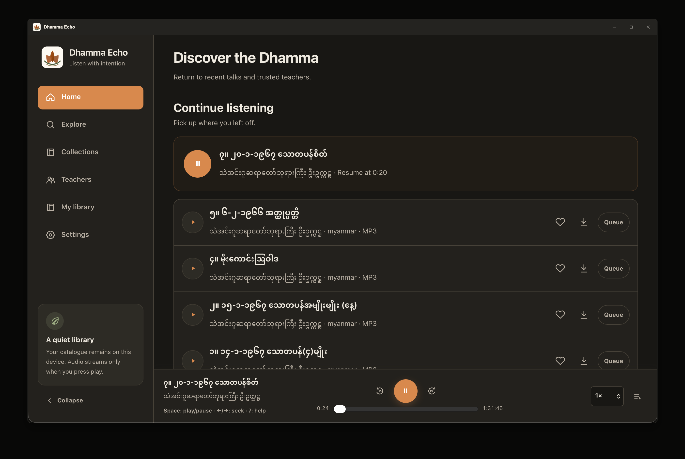
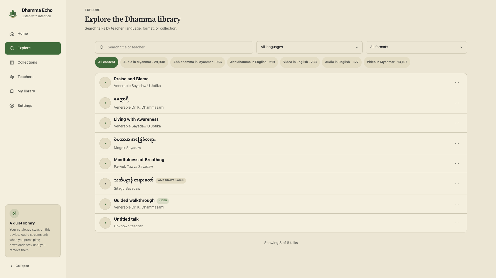
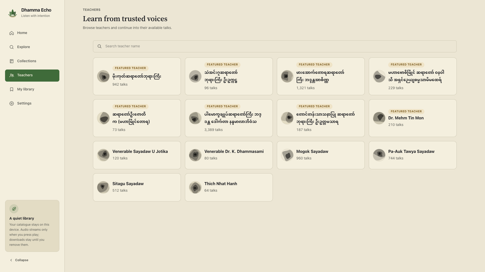
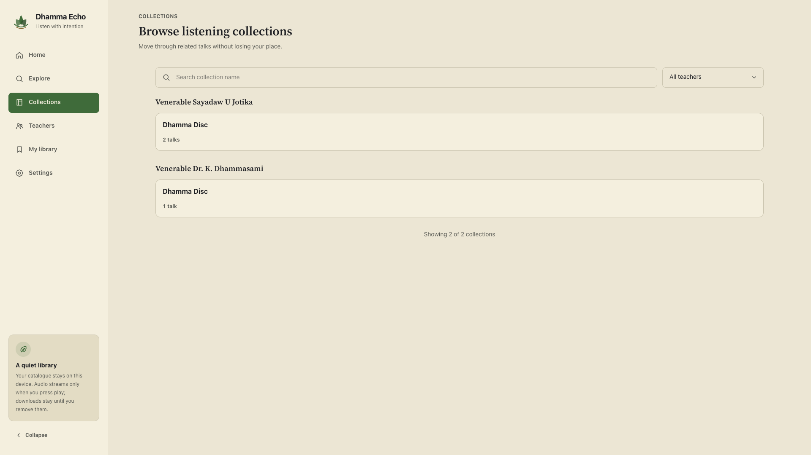
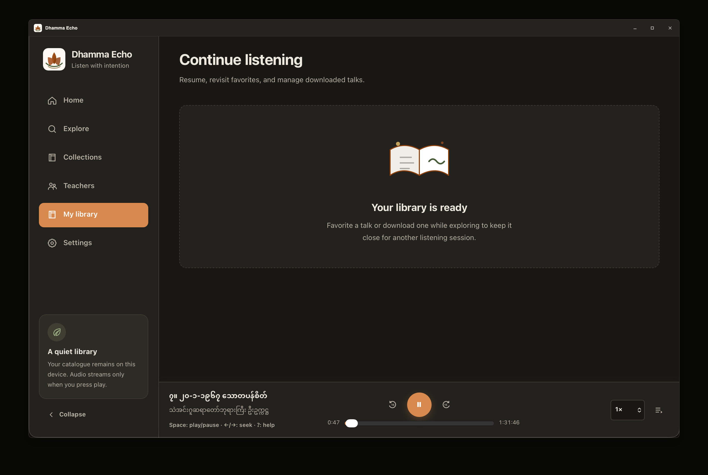
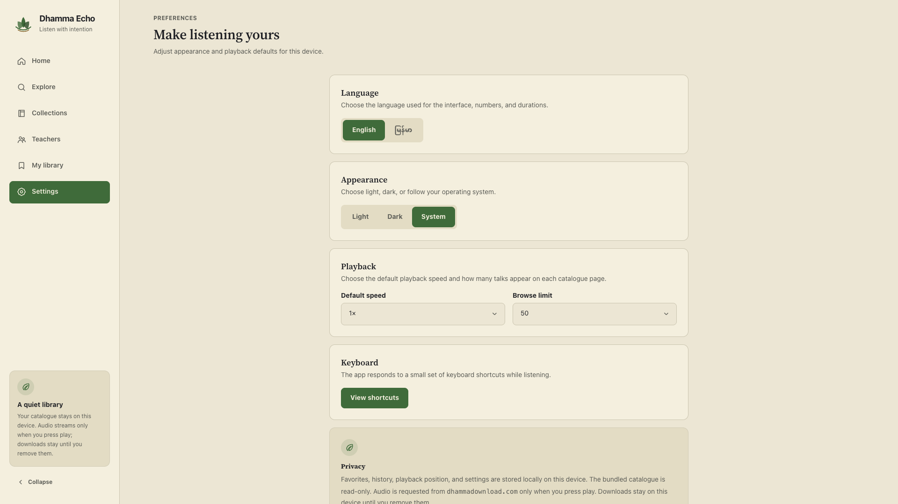
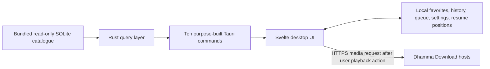

# Dhamma Echo

**Dhamma, without the noise.** A private desktop library for discovering, listening to, and resuming Dhamma audio and video teachings.

[](LICENSE)
[](https://tauri.app)
[](https://svelte.dev)
[](https://www.typescriptlang.org)



## Install

### macOS with Homebrew

```bash
brew install --cask AungMyoKyaw/homebrew-tap/dhamma-echo
```

Dhamma Echo is currently ad-hoc signed, so the Homebrew cask removes the quarantine attribute during installation. If macOS still blocks the first launch, right-click the app and choose **Open** once.

### macOS, Windows, and Linux installers

Download the latest `.dmg`, `.msi` / `-setup.exe`, `.deb`, `.rpm`, or `.AppImage` from [GitHub Releases](https://github.com/AungMyoKyaw/dhamma-echo/releases).

## What Dhamma Echo is

Dhamma Echo turns a large Dhamma catalogue into a desktop library instead of a feed. It helps you find a teaching, play a compatible source file, keep your place, and return later without creating an account.

| Catalogue | Current index |
| --- | ---: |
| Audio talks | **30,563** |
| Video records | **14,474** |
| Teachers | **257** |
| Audio collections | **429** |

The application does **not** host those media files. It catalogs records sourced from [Dhamma Download](https://www.dhammadownload.com/) and requests compatible media from the approved Dhamma Download hosts when you choose to play it. See [Data and licensing](#data-and-licensing) before redistributing catalogue data or media references.

## Built as a library, not a feed

- **Find what you came for.** Search titles and teachers, then filter by content category, collection, teacher, language, and source format.
- **Listen without losing context.** Keep the player available while browsing, with seek, 15-second jumps, playback speed, queue management, and resume positions.
- **Audio and video share one library.** History, favorites, queue state, and resume positions work across supported MP3 audio and MP4 video.
- **Return where you left off.** Recent listening activity and saved state stay on the device.
- **Keep personal activity private.** No accounts, analytics, ads, telemetry, or cloud sync.
- **Keep the source catalogue intact.** Legacy WMA and WMV records remain searchable even when the macOS webview cannot play them.

## See the product

| Explore | Teachers |
| --- | --- |
|  |  |

| Collections | My library |
| --- | --- |
|  |  |

| Home | Settings |
| --- | --- |
|  |  |

## Playback and catalogue behavior

Dhamma Echo keeps catalogue visibility separate from playback capability.

| Source format | Searchable | In-app playback |
| --- | --- | --- |
| MP3 | Yes | Yes, from approved HTTPS hosts |
| MP4 | Yes | Yes, from approved HTTPS hosts |
| WMA | Yes | Not available in the macOS webview |
| WMV | Yes | Not available in the macOS webview |

For playable records, the app normalizes and encodes catalogue URLs, removes credentials, ports, and fragments, upgrades approved same-host HTTP URLs to HTTPS, and can retry between the `www` and bare Dhamma Download hosts. A source file that has been removed or blocked by the remote service cannot be recovered by the app.

## Privacy by architecture

Your personal listening state stays in the webview's local storage. The bundled catalogue is opened read-only. The application has no account backend and no analytics or telemetry service.



Security boundaries that matter:

- SQLite opens read-only and all queries are parameterized.
- The webview exposes only ten purpose-built Tauri commands: nine catalogue operations and one constrained MP3 download path. There is no arbitrary SQL, shell, or general-purpose filesystem API.
- The CSP permits media only from `https://dhammadownload.com` and `https://www.dhammadownload.com`.
- Personal library state is not sent to the developer.
- Security issues should be reported through [SECURITY.md](SECURITY.md), not a public issue.

Read the published [privacy policy](docs/privacy/).

## Architecture

Dhamma Echo is intentionally small: a Svelte application in a Tauri shell, a Rust read-only catalogue boundary, native HTML media playback, and local browser storage for personal state.

- [System context](docs/architecture/context.md)
- [Modules and trust boundaries](docs/architecture/modules.md)
- [Catalogue and playback data flow](docs/architecture/data-flow.md)
- [UI shell and responsive layout](docs/architecture/ui-shell.md)
- [Build and release flow](docs/architecture/release.md)
- [Product website architecture](docs/architecture/product-site.md)
- [Ralph Loop](docs/ralph-loop.md)

### Technology

- Tauri 2
- Rust 2024 edition
- `rusqlite` with bundled SQLite
- Svelte 5 + strict TypeScript + Vite
- Tailwind CSS v4 through the official Vite plugin
- Native HTML audio/video wrapped by the app's media engine
- Node built-in test runner and V8 coverage

## Run from source

### Requirements

- Node.js 22.13 or newer
- Bun 1.4.0-canary.1, as pinned by `packageManager`
- Rust 1.85 or newer with Cargo and rustfmt
- Tauri 2 platform prerequisites

Linux development additionally needs WebKitGTK 4.1 and the standard Tauri Linux build packages.

### Install dependencies

```bash
git clone https://github.com/AungMyoKyaw/dhamma-echo.git
cd dhamma-echo
bun install --frozen-lockfile --ignore-scripts
```

`bun.lock` and `src-tauri/Cargo.lock` are authoritative. If dependencies intentionally change, run `bun install`, review the dependency and lockfile diff, and commit only the expected changes.

### Start the app

Desktop development:

```bash
bun run dev
```

Browser preview with deterministic mock catalogue data:

```bash
bun run dev:web
```

Then open `http://127.0.0.1:51729`.

## Useful commands

| Command | Purpose |
| --- | --- |
| `bun run dev` | Run the Tauri desktop application |
| `bun run dev:web` | Run the browser preview with HMR |
| `bun run format` | Format web and Rust sources |
| `bun run lint` | Run strict ESLint with zero warnings |
| `bun run typecheck` | Run strict Svelte/TypeScript checking |
| `bun run test` | Run TypeScript behavior tests |
| `bun run test:coverage` | Run the core TypeScript coverage gate |
| `bun run verify:web` | Run the complete web-app verification gate |
| `bun run site:verify` | Verify the static product website |
| `bun run verify` | Run formatting, web, site, audit, clippy, Rust tests, and release build |
| `bun run package` | Build native installers with Tauri |

## Verification bar

The repository treats verification as part of the product, not as a release afterthought.

- ESLint runs with `--max-warnings 0`.
- `svelte-check` runs in strict mode.
- Focused or skipped required tests are rejected by policy.
- Core TypeScript behavior modules enforce **100% lines**, **100% functions**, and at least **99% branches** with Node's V8 coverage.
- The static product site's JavaScript enforces **100% line / function / branch coverage**.
- Site smoke tests reject missing local assets, path escapes, duplicate IDs, remote runtime dependencies, and text assets over 100 KiB.
- Rust verification includes rustfmt, clippy with `-D warnings`, tests, and a locked release build.

The coverage gate does not measure Svelte component statements separately; component correctness is checked through type checking, build/smoke gates, and behavior contracts. The repository does not claim a metric the tooling does not measure.

## Product website

The launch site under [`docs/`](docs/index.html) is deliberately dependency-free and separate from the Tauri webview build.

Preview it locally:

```bash
python3 -m http.server 4173 --directory docs
```

Then open `http://127.0.0.1:4173` and run:

```bash
bun run site:verify
```

## Configuration and storage

- The SQLite catalogue is bundled as an immutable application resource.
- Favorites, history, queue, settings, and resume positions are stored locally.
- Myanmar text uses installed system fonts; no font files are bundled.
- Media network access is restricted to the approved Dhamma Download hosts.

## Data and licensing

The source code and original project assets are licensed under MIT. The bundled `dhamma.db`, catalogue metadata, remote media, teacher names, and teachings are **not relicensed by this repository**.

Read [DATA_LICENSE.md](DATA_LICENSE.md) before public redistribution. Source media and catalogue records originate from [Dhamma Download](https://www.dhammadownload.com/); availability and rights remain with their respective source/rights holders.

## Troubleshooting

### A record is visible but will not play

Check the source format first. WMA and WMV remain searchable but are not playable in the macOS webview. For MP3 or MP4, use the in-player retry path; Dhamma Echo can retry the approved HTTPS hostnames, but it cannot restore a file removed or blocked by the source service.

### Myanmar text uses an unexpected font

Install or enable a Unicode Myanmar font such as Noto Sans Myanmar, Myanmar Text, or Pyidaungsu. The application deliberately does not bundle font files.

### Native build fails on Linux

Install Tauri's WebKitGTK 4.1 development dependencies and `patchelf`, then rerun `bun run package`.

### Registry installation fails

Confirm Bun and Cargo can reach their configured registries. This repository does not vendor third-party packages.

## Contributing

Read [CONTRIBUTING.md](CONTRIBUTING.md), follow the [Code of Conduct](CODE_OF_CONDUCT.md), and run `bun run verify` before opening a pull request.

For release history, see [CHANGELOG.md](CHANGELOG.md). For security reporting, see [SECURITY.md](SECURITY.md).

## License

MIT for the source code and original project assets. See [LICENSE](LICENSE) and [DATA_LICENSE.md](DATA_LICENSE.md).
