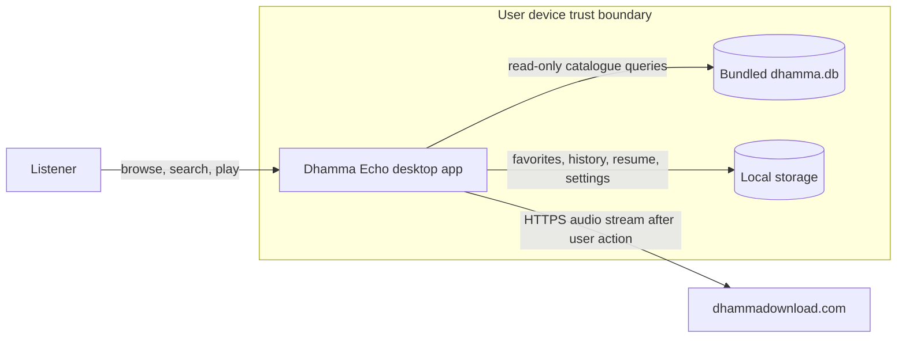

# System context

The application has no account service, cloud database, analytics endpoint, updater service, or background daemon. The only external runtime dependency is the selected remote audio stream.
