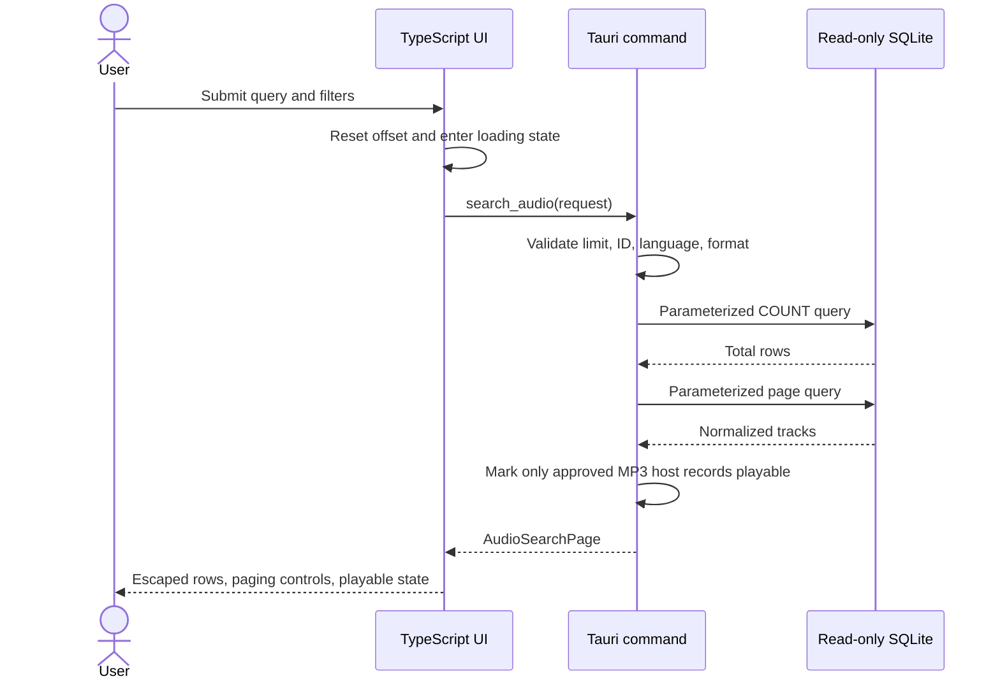
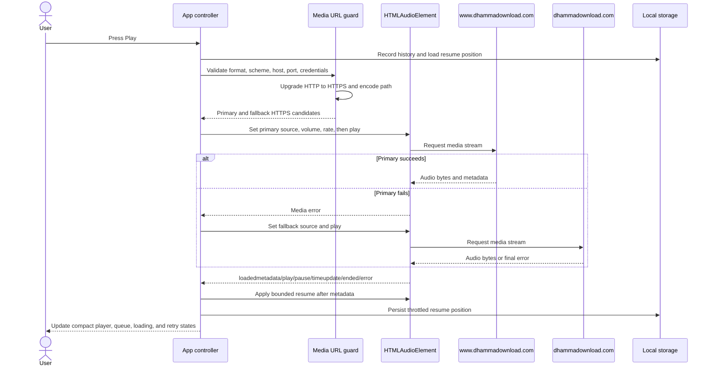

# Catalogue and playback data flow

## Search sequence

## Playback sequence

The database does not contain duration metadata. Resume is applied only after the audio element exposes media metadata. Completion resets the saved position to zero so replaying a finished talk starts from the beginning.
