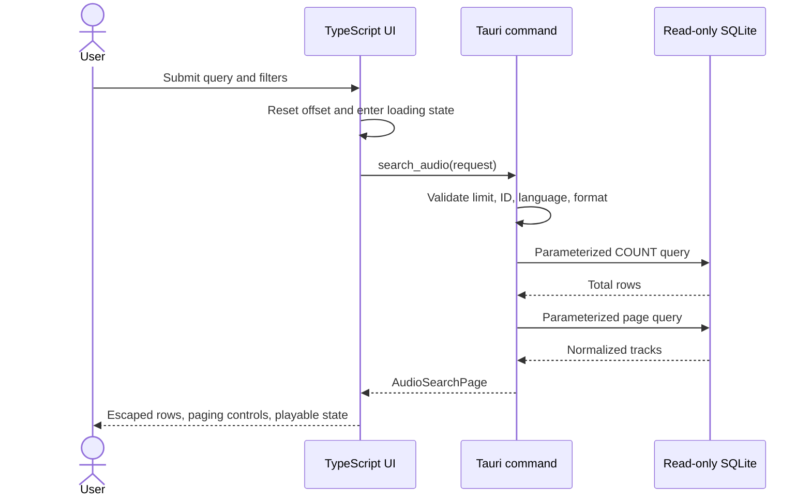
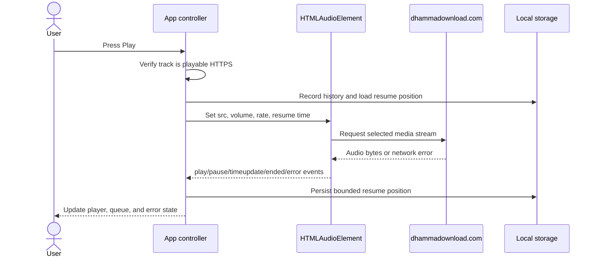

# Catalogue and playback data flow

## Search sequence

```mermaid
sequenceDiagram
    actor User
    participant UI as TypeScript UI
    participant IPC as Tauri command
    participant DB as Read-only SQLite

    User->>UI: Submit query and filters
    UI->>UI: Reset offset and enter loading state
    UI->>IPC: search_audio(request)
    IPC->>IPC: Validate limit, ID, language, format
    IPC->>DB: Parameterized COUNT query
    DB-->>IPC: Total rows
    IPC->>DB: Parameterized page query
    DB-->>IPC: Normalized tracks
    IPC-->>UI: AudioSearchPage
    UI-->>User: Escaped rows, paging controls, playable state
```

## Playback sequence

```mermaid
sequenceDiagram
    actor User
    participant UI as App controller
    participant Audio as HTMLAudioElement
    participant Remote as dhammadownload.com
    participant Local as Local storage

    User->>UI: Press Play
    UI->>UI: Verify track is playable HTTPS
    UI->>Local: Record history and load resume position
    UI->>Audio: Set src, volume, rate, resume time
    Audio->>Remote: Request selected media stream
    Remote-->>Audio: Audio bytes or network error
    Audio-->>UI: play/pause/timeupdate/ended/error events
    UI->>Local: Persist bounded resume position
    UI-->>User: Update player, queue, and error state
```

Duration is unknown in SQLite. The player displays duration only after the audio element receives media metadata.
