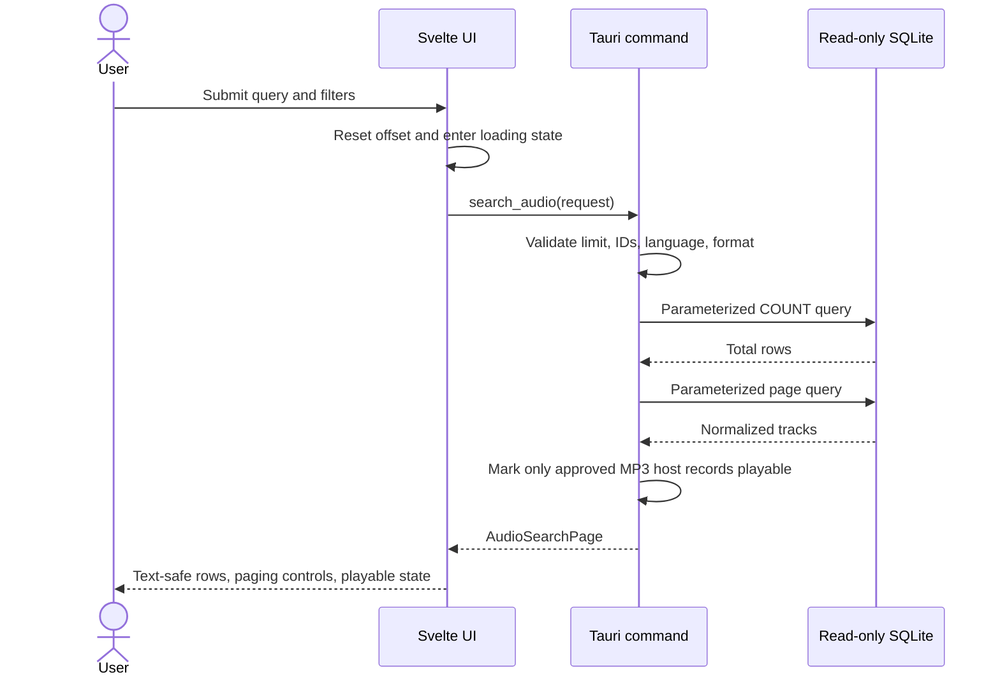
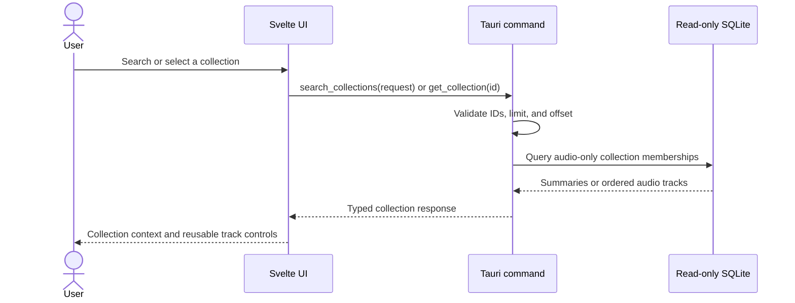

# Catalogue and playback data flow

## Search sequence



## Collection sequence



Collection tracks sort by explicit track number and then media ID. Missing titles and teachers use
`Untitled talk` and `Unknown teacher`; incomplete optional metadata never hides a playable audio URL.
Crawler and provenance tables are not exposed through application commands.

## Playback sequence

```mermaid
sequenceDiagram
    actor User
    participant UI as App controller
    participant Guard as Media URL guard
    participant Media as HTMLMediaElement<br/>(audio or video)
    participant Primary as www.dhammadownload.com
    participant Fallback as dhammadownload.com
    participant Local as Local storage

    User->>UI: Press Play
    UI->>Local: Record history and load resume position
    UI->>Guard: Validate format, scheme, host, port, credentials
    Guard->>Guard: Upgrade HTTP to HTTPS and encode path
    Guard-->>UI: Primary and fallback HTTPS candidates
    alt Track mediaType is "video"
        UI->>UI: Navigate to play route; persistent audio footer hides
    end
    UI->>Media: Set primary source and rate, then play
    Media->>Primary: Request media stream
    alt Primary succeeds
        Primary-->>Media: Media bytes and metadata
    else Primary fails
        Media-->>UI: Media error
        UI->>Media: Set fallback source and play
        Media->>Fallback: Request media stream
        Fallback-->>Media: Media bytes or final error
    end
    Media-->>UI: loadedmetadata/play/pause/timeupdate/ended/error
    UI->>Media: Apply bounded resume after metadata
    UI->>Local: Persist throttled resume position
    UI-->>User: Update compact player, queue, loading, and retry states
```

The database does not contain duration metadata. Resume is applied only after the media element exposes its metadata. Completion resets the saved position to zero so replaying a finished talk starts from the beginning. Audio plays in the persistent footer; video opens the `play` route and renders `VideoView` with the same transport skin and keyboard shortcuts (`space`, `←`, `→`, `Esc`).
