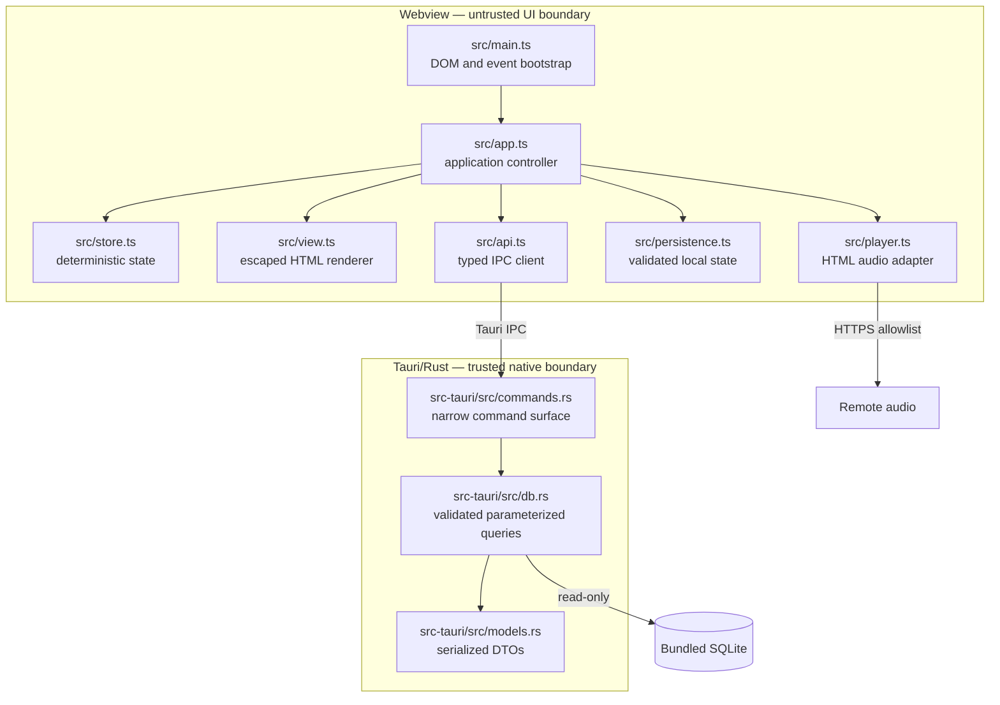

# Modules and trust boundaries

## Boundaries

- The webview never receives a generic SQL command, filesystem path, or shell interface.
- Rust validates identifiers, page limits, language, format, and teacher filters.
- The renderer escapes catalogue strings before inserting them into HTML.
- The audio adapter independently verifies the HTTPS host before playback.
- Local storage data is treated as untrusted and schema-checked on every load.
