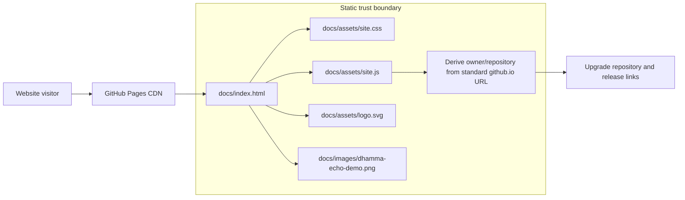
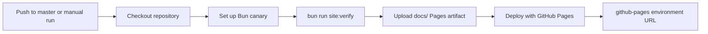

# Product website architecture

Dhamma Echo's product website is a dependency-free static surface under `docs/`. It is deliberately separate from the TypeScript bundle loaded by the Tauri desktop webview.

## Browser asset flow

The page makes no runtime request for fonts, scripts, styles, analytics, or media. The only browser code parses the current page URL. On a standard `owner.github.io/repository/` deployment it upgrades the repository and release links. On localhost, a custom domain, an invalid URL, or a user-site root, it leaves safe in-page fallback links unchanged.

## Deployment flow

The build job has read-only repository permission. The deploy job receives only `pages: write` and `id-token: write`, and it cannot run until validation and artifact upload complete.

## Boundaries

- The product site does not import files from `src/`, `dist/`, or `src-tauri/` at runtime.
- The website and desktop application share only repository-owned visual assets and documented product facts.
- The supplied screenshot remains at `docs/images/dhamma-echo-demo.png`; it is not copied into a second deploy tree.
- The site's Content Security Policy blocks network connections, frames, objects, external fonts, and nonlocal runtime assets.
- GitHub Pages serves static product material only. It does not proxy the catalogue, audio, SQLite database, or Tauri commands.

## Performance budget

- HTML, CSS, JavaScript, and logo: less than 100 KiB each.
- No framework or package installation is required to render the site.
- The supplied screenshot is the largest asset and retains its native 3248×2122 dimensions to avoid a second lossy derivative in the repository.
- CSS uses system fonts and honors reduced-motion preferences.

## Validation

`bun run site:verify` runs Node built-in behavior tests and a dependency-free smoke checker. The smoke checker validates local references, unique IDs, asset containment under `docs/`, static file budgets, screenshot presence, and the absence of remote runtime dependencies or local machine paths.
