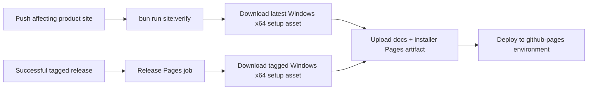

# Build and release flow

```mermaid
flowchart LR
    commit[Commit or pull request] --> install[Install Bun-managed web and Rust dependencies]
    install --> format[Prettier + rustfmt]
    format --> lint[ESLint + clippy]
    lint --> typecheck[svelte-check + TypeScript]
    typecheck --> test[TypeScript + Rust tests]
    test --> coverage[Core TypeScript coverage gate]
    coverage --> build[Web production build]
    build --> smoke[Static asset smoke checks]
    smoke --> icons[Desktop icon geometry and config checks]
    icons --> native[Tauri native build matrix]
    native --> artifacts[macOS / Windows / Linux artifacts]
    artifacts --> release[GitHub release on version tag]
```

## GitHub Pages flow

The Pages workflow validates the static site, downloads the latest release's
Windows x64 `-setup.exe` with the GitHub CLI, and uploads it alongside `docs/`.
The release workflow has a dependent Pages job that downloads the installer
from the exact tag it just published, so a new release updates the direct
package URL without a second manual workflow run.

The published package keeps its release filename under
`downloads/`, for example:
`Dhamma.Echo_0.5.5_x64-setup.exe`. GitHub Pages serves that file directly,
without the GitHub Releases redirect. The artifact still excludes source
files, the bundled SQLite catalogue, native build output, and local
development artifacts.

## Release controls

- Pull requests receive read-only workflow permissions.
- Release publishing runs only for version tags and receives `contents: write`.
- Native packages are built on their matching operating-system runners.
- Signing and notarization secrets are not stored in the repository.
- A release is blocked until lockfiles, dependency audits, desktop icon checks, and native smoke tests pass.
- GitHub Pages validation runs before artifact upload; deployment receives only `pages: write` and `id-token: write`.
