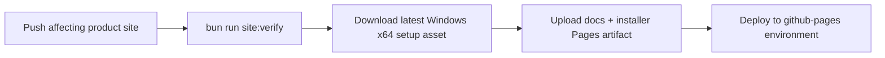

# Build and release flow

```mermaid
flowchart LR
    commit[Commit or pull request] --> install[Install Bun-managed web and Rust dependencies]
    install --> format[Prettier + rustfmt]
    format --> lint[ESLint + clippy]
    lint --> typecheck[svelte-check + TypeScript]
    typecheck --> test[TypeScript + Rust tests]
    test --> coverage[Core TypeScript coverage gate]
    coverage --> build[Web production build]
    build --> smoke[Static asset smoke checks]
    smoke --> icons[Desktop icon geometry and config checks]
    icons --> native[Tauri native build matrix]
    native --> artifacts[macOS / Windows / Linux artifacts]
    artifacts --> release[GitHub release on version tag]
```



## GitHub Pages flow



The Pages workflow validates the static site, downloads the latest release's
Windows x64 `-setup.exe` with the GitHub CLI, and uploads it alongside `docs/`.

The published package keeps its release filename under
`downloads/`, for example:
`Dhamma.Echo_0.5.5_x64-setup.exe`. GitHub Pages serves that file directly,
without the GitHub Releases redirect. The artifact still excludes source
files, the bundled SQLite catalogue, native build output, and local
development artifacts.

## Microsoft Store MSIX pipeline

```mermaid
flowchart LR
    tag[Tag push v* or manual dispatch] --> buildJ[Build matrix]
    buildJ -->|windows-latest success| msixJ[build-msix job]
    msixJ --> check[bun run icons:msix:check]
    check --> tauriBuild[tauri build --no-bundle]
    tauriBuild --> setup[setup-WinAppCli@v0.1]
    setup --> substitute[Substitute __APP_VERSION__ + __PUBLISHER__]
    substitute --> stage[Stage exe + DLLs + resources/dhamma.db + manifest + Assets]
    stage --> pack[winapp pack ./msix-staging --output Dhamma.Echo_<ver>_x64.msix]
    pack --> attach[gh release upload --clobber]
    attach --> partnerCenter[Partner Center manual upload]
    partnerCenter --> storeSigned[Store signs MSIX and publishes]
```

The Tauri project does not bundle MSIX natively, so the release
workflow runs a separate `build-msix` job on `windows-latest` after
the matrix completes. It rebuilds the Tauri binary without an
installer, hands it to Microsoft's `winapp` CLI, and uploads the
unsigned MSIX to the existing GitHub release.

The staging helper copies the complete `src-tauri/resources` directory into
the package root as `resources/`, including the required `resources/dhamma.db`
runtime catalogue opened by the Windows application at startup.
The workflow also exposes `workflow_dispatch` so a packaging-only
fix can be applied to the release represented by the checked-out
version without moving an existing tag.

The MSIX is intentionally **unsigned**. Partner Center signs it with
the publisher identity reserved for the Dhamma Echo app name, so no
EV/OV certificate or Azure Trusted Signing is required. The free
individual Microsoft Store account is sufficient.

### Required GitHub repository secret

| Secret           | Purpose                                                                                                                                                                                      | Example                       |
| ---------------- | -------------------------------------------------------------------------------------------------------------------------------------------------------------------------------------------- | ----------------------------- |
| `MSIX_PUBLISHER` | The exact `Package/Identity/Publisher` value from Partner Center → Product management → Product identity. Copy the complete value, including `CN=`, capitalization, punctuation, and spaces. | `CN=REPLACE_WITH_EXACT_VALUE` |

The account-settings **Publisher name** (`AungMyoKyaw`) is the
public display name. It is not necessarily the package identity
publisher and must not be guessed or transformed into `CN=...`.
Reserve the app first, then copy the exact identity value from the
product's **Product identity** page.

The workflow fails fast if the secret is missing or empty. The
manifest contains `__APP_VERSION__` and `__PUBLISHER__` placeholders
that the workflow substitutes before invoking `winapp pack`.

### Local validation

Run `bun run icons:msix:check` to validate the placeholder manifest
and the six Microsoft Store PNG tiles committed under
`src-tauri/msix/Assets/`. Regenerate the assets with
`bun run icons:msix:generate` (requires Pillow) after editing
`src-tauri/icons/app-icon.png`.

## Release controls

- Pull requests receive read-only workflow permissions.
- Release publishing runs only for version tags and receives `contents: write`.
- Native packages are built on their matching operating-system runners.
- Signing and notarization secrets are not stored in the repository.
- A release is blocked until lockfiles, dependency audits, desktop icon checks, and native smoke tests pass.
- GitHub Pages validation runs before artifact upload; deployment receives only `pages: write` and `id-token: write`.
