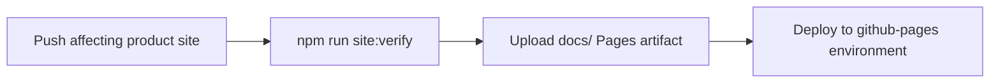

# Build and release flow

```mermaid
flowchart LR
    commit[Commit or pull request] --> install[Install Node and Rust dependencies]
    install --> format[Prettier + rustfmt]
    format --> lint[ESLint + clippy]
    lint --> test[TypeScript + Rust tests]
    test --> coverage[Core TypeScript coverage gate]
    coverage --> build[Web production build]
    build --> smoke[Static asset smoke checks]
    smoke --> icons[Desktop icon geometry and config checks]
    icons --> native[Tauri native build matrix]
    native --> artifacts[macOS / Windows / Linux artifacts]
    artifacts --> release[GitHub release on version tag]
```

## GitHub Pages flow

The Pages workflow is independent from the Tauri installer workflow. It uploads only `docs/`, so the static website never publishes source files, the bundled SQLite catalogue, native build output, or local development artifacts.

## Release controls

- Pull requests receive read-only workflow permissions.
- Release publishing runs only for version tags and receives `contents: write`.
- Native packages are built on their matching operating-system runners.
- Signing and notarization secrets are not stored in the repository.
- A release is blocked until lockfiles, dependency audits, desktop icon checks, and native smoke tests pass.
- GitHub Pages validation runs before artifact upload; deployment receives only `pages: write` and `id-token: write`.
