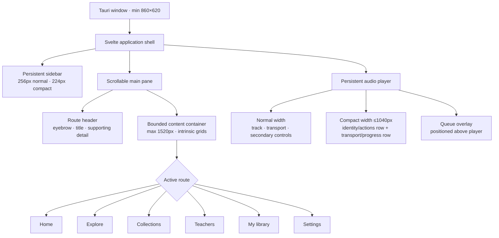

# UI shell and responsive layout

Dhamma Echo keeps one desktop shell and lets the content area adapt around it. The application does not maintain a second mobile navigation model.

## Layout rules

- The sidebar remains visible at every supported window size and narrows from 256px to 224px at compact desktop widths.
- The main pane is a CSS container with a 1520px maximum content measure. Card grids use intrinsic `minmax` sizing, so columns respond to usable content width rather than fixed viewport assumptions.
- Search/filter forms use wrapping flex layouts so controls keep practical minimum widths instead of collapsing near the 860px minimum window.
- The player remains a three-zone footer at normal widths and becomes a deliberate two-row composition at compact widths. Main content reserves enough bottom space for the larger compact player.
- Queue content stays above the player layer and remains independently scrollable.
- The same structure is used for light and dark themes; only design tokens change.

## Accessibility rules

- Navigation and primary playback targets are at least 44px tall/wide where practical.
- Critical row actions use 40–44px controls and visible keyboard focus.
- Interactive cards are semantic buttons, not clickable generic containers.
- Myanmar text keeps `lang="my"` and the dedicated line-breaking class.
- Reduced-motion preferences disable decorative transition/animation duration globally; loading skeletons also opt out explicitly.
