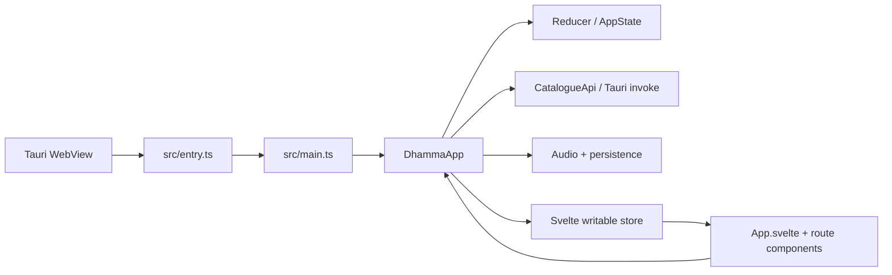

# Svelte Frontend Migration Verification — 2026-08-10

## Result

The desktop presentation layer has been migrated from the custom HTML-string renderer and delegated `data-action` event system to Svelte 5 components mounted by Vite. The existing Tauri 2 shell, `DhammaApp` controller, reducer/store, catalogue API, persistence, audio engine, database boundary, and product website remain in place.

The source migration is implemented, but the full release gate is **not complete in this sandbox** because Bun/Cargo are unavailable and the configured npm registry does not contain Svelte. The dependency lockfile therefore cannot be regenerated here, and dependency-backed Svelte/Vite/Prettier/ESLint/native gates cannot be honestly reported as passing.

## Ralph Loop

### Fast inner-loop evidence

- `git diff --check` — passed.
- `node scripts/lint-offline.mjs` — `offline lint: 0 errors`.
- `tsc -p tsconfig.test.json && node --test tests/*.test.mjs` — 85 tests passed, 0 failed, 0 skipped, 0 todo.
- Core TypeScript V8 coverage — 100% lines, 100% branches, 100% functions for `api`, `app`, `mock-data`, `persistence`, `player`, `runtime`, `store`, `ui`, and `utils`.
- Raw HTML/event-delegation scan — no `{@html}`, `data-action=`, `root.addEventListener`, or `innerHTML =` patterns in migrated source.
- Svelte embedded TypeScript parser fallback — 20 component script blocks extracted and parsed/transformed with `tsc --noCheck`; this is supplementary evidence only and is not a Svelte compiler check.
- Product website verification — 14 tests passed; static-site coverage remained 100% lines/branches/functions; smoke check passed.
- Icon verification — 6 assets, 411,514 bytes; expected 1024×1024 master geometry passed.

### Release-loop blockers

Environment evidence:

```text
Node: v22.16.0
TypeScript: 5.8.3
Bun: unavailable
Cargo: unavailable
npm registry: https://packages.applied-caas-gateway1.internal.api.openai.org/artifactory/api/npm/npm-public
svelte@5.56.8 lookup: E404 (package absent from configured registry)
public npm registry lookup: timed out
```

Because the repository preserves Bun and its frozen-lockfile workflow, `bun.lock` was not hand-edited. It remains to be regenerated by a real `bun install` in an environment that can resolve the newly added frontend dependencies.

## Architecture

The migration keeps one canonical behavior/state layer:



The Svelte layer renders state and forwards typed user intent to existing application methods/actions. Catalogue strings use normal Svelte interpolation; the migration does not use `{@html}`.

## Quality Gates

| Gate | Status | Evidence | Notes |
| --- | --- | --- | --- |
| Formatter | `BLOCKED` | `prettier-plugin-svelte` cannot be installed from the available registry | `git diff --check` and offline whitespace lint pass, but they are not substitutes for Prettier on `.svelte` files. |
| Linter | `BLOCKED` | `eslint-plugin-svelte` cannot be installed | Dependency-free `node scripts/lint-offline.mjs` reports 0 errors. Full ESLint is required before release. |
| Type checker | `BLOCKED` | `svelte-check` cannot be installed | Core TS compiles with `tsc -p tsconfig.test.json`; all 20 embedded Svelte TS scripts parse with fallback `tsc --noCheck`. |
| Tests | `PASS` | `tsc -p tsconfig.test.json && node --test tests/*.test.mjs` | 85 passed, 0 failed, 0 skipped, 0 todo. |
| Coverage | `BLOCKED` | Node V8 core report: 100% lines / 100% branches / 100% functions | Node does not expose a separate statement metric, and Svelte executable component coverage cannot be measured without the Svelte test/build toolchain. |
| Build | `BLOCKED` | Vite/Svelte packages unavailable | `vite build` cannot run without installed dependencies. |
| Packaging | `BLOCKED` | Cargo and Tauri build toolchain unavailable | Native Tauri packaging was not executed. |
| Security checks | `BLOCKED` | `bun audit` and `cargo audit` cannot run | Static scan confirms no `{@html}` or old delegated renderer remains; existing Rust/Tauri trust boundary was not changed. |
| UI visual verification | `BLOCKED` | No compiled Vite/Svelte frontend can be launched in this sandbox | Source review is not counted as visual verification. |
| Lightweight measurements | `BLOCKED` | Source comparison: old `src/view.ts + src/main.ts` 51,470 bytes; new Svelte files 46,600 bytes; production npm deps 0 → 0 | Final production bundle size cannot be measured until Vite can build. |
| Dependency/lockfile verification | `BLOCKED` | New dependency manifest is present; `bun.lock` intentionally not fabricated | Run `bun install` with Bun 1.3.14 and commit the regenerated lockfile, then use frozen installs. |
| Product website | `PASS` | `npm run site:verify` | 14 tests passed; coverage 100% line/branch/function; smoke passed. |
| Icons | `PASS` | `node scripts/verify-icons.mjs` | 6 assets validated; 411,514 bytes total. |
| Git bundle verification | `PASS` | `git bundle verify /mnt/data/dhamma-echo-svelte.bundle`; clone/checkout of `feat/svelte-frontend`; cloned `tsc -p tsconfig.test.json && node --test tests/*.test.mjs` | Verified at migration commit `5f051cc`: complete history, bundle OK, cloned suite 85/85 passed. |

## Dependency Change Record

New build/development dependencies:

- `svelte` — component runtime/compiler for the requested frontend migration.
- `@sveltejs/vite-plugin-svelte` — official Svelte integration for Vite.
- `vite` — standalone SPA development and production build pipeline used by the Tauri webview.
- `svelte-check` — Svelte/TypeScript diagnostics.
- `prettier-plugin-svelte` — formatter support for `.svelte` files.
- `eslint-plugin-svelte` — Svelte-specific lint rules.
- `@tailwindcss/vite` — Tailwind CSS v4 Vite integration.

Removed build dependency:

- `@tailwindcss/cli` — replaced by the Tailwind Vite plugin because Vite now owns the web build.

No production npm dependencies were added. The app still loads no third-party JavaScript from the network at runtime.

## Required Final Release Work on a Networked Development Machine

```bash
bun install
bun run format:web
bun run format:web:check
bun run lint
bun run typecheck
bun run test:coverage
bun run build:web
bun run smoke:web
bun run icons:check
bun audit --audit-level=high
cargo fmt --manifest-path src-tauri/Cargo.toml -- --check
cargo clippy --manifest-path src-tauri/Cargo.toml --all-targets --all-features -- -D warnings
cargo test --manifest-path src-tauri/Cargo.toml --all-features
bun run tauri:build
```

After `bun install` succeeds, review and commit only the intended `bun.lock` dependency changes, then future clean installs must return to `bun install --frozen-lockfile --ignore-scripts`.
